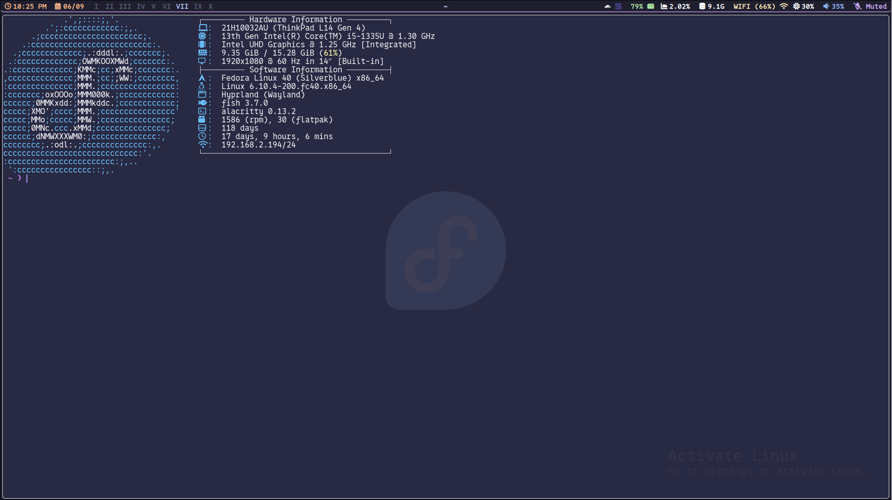

# My dotfiles

# This config is **NOT** user friendly and should **NOT** be used in its entirety without prior knowledge on configuring Hyprland or any of the other programs



## Installation (please dont)
```sh
git clone https://github.com/Book-reader/dotfiles
cd dotfiles
./install.sh
```

## Other things needed
to setup vim you need to run :PlugInstall

If you would rather use neovim instead of emacs for terminal editing, in fish/config.fish, set EDITOR to "nvim" and EDITORARGS to ""
To make the caps lock key work instead of pressing Control, remove the line "kb_options = caps:ctrl_modifier" in hypr/hyprland.conf

### fonts needed:
 - NotoSans Nerd Font
 - Mononoki Nerd Font
 - Cartograph CF Nerd Font
 - 0xProto Nerd Font (only for emacs)

### themes needed:
 - Sweet-cursors
 - Catppuccin-green gtk

### programs needed:
 - hyprland
 - hyprlock
 - hyprpaper
 - hypridle
 - waybar
 - eza
 - alacritty
 - tofi
 - brightnessctl
 - pamixer
 - fastfetch
 - htop
 - fish
 - starship
 - trash-cli
 - fastfetch
 - zoxide
 - neovim
 - rofi-wayland
 - rofi-power-menu
 - wl-clipboard
 - dunst
 - emacs